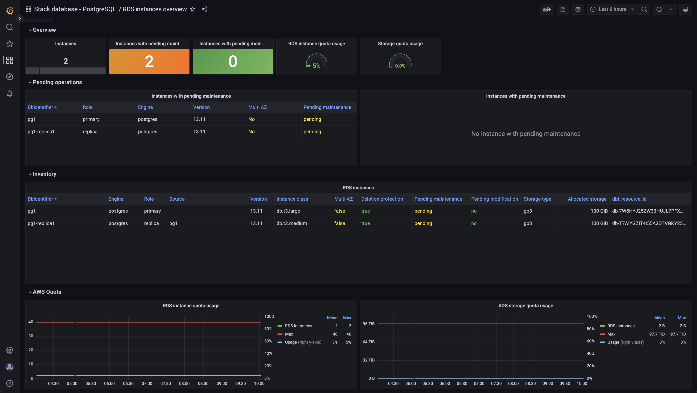
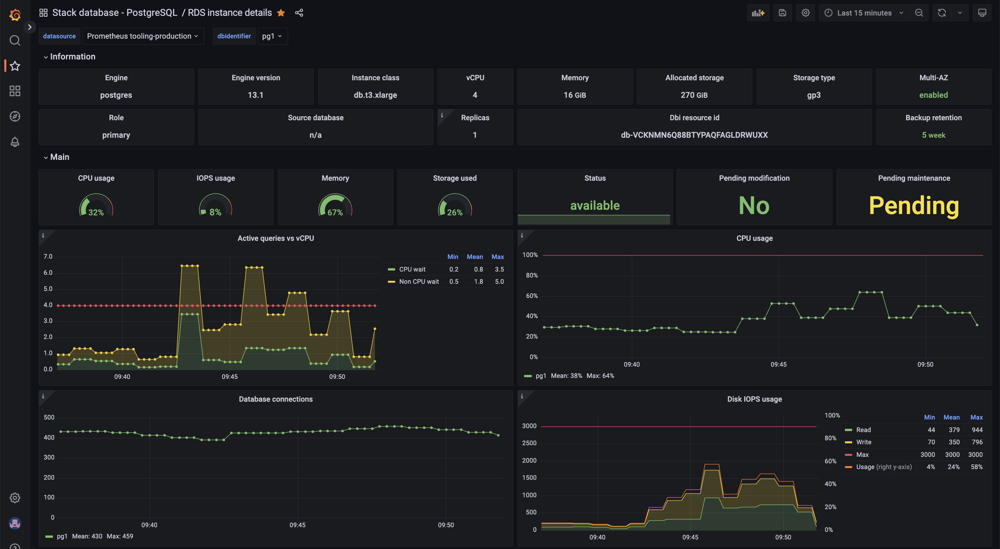
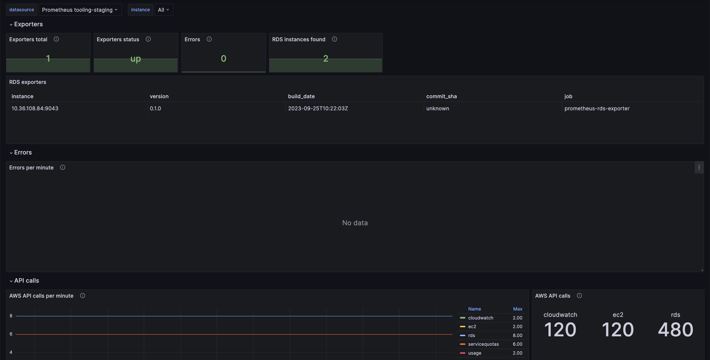

<!-- markdownlint-disable-next-line -->


# Prometheus RDS exporter

Are you ready to take your AWS RDS monitoring to the next level? Say hello to prometheus-rds-exporter, your ultimate solution for comprehensive, real-time insights into your Amazon RDS instances!

Built by SRE Engineers, designed for production: Meticulously crafted by a team of Site Reliability Engineers with years of hands-on experience in managing RDS production systems. Trust in their expertise to supercharge your monitoring.

It collects key metrics about:

- Hardware resource usage
- Underlying EC2 instance's hard limits
- Pending AWS RDS maintenance operations
- Pending modifications
- Logs size
- RDS quota usage information
- AWS Performance Insights

> [!TIP]
> Prometheus RDS exporter is part of the [Database Monitoring Framework](https://github.com/qonto/database-monitoring-framework) which provides alerts, along with their handy runbooks for AWS RDS.

## Key metrics

🥇 Advanced Metrics: Gain deep visibility with advanced metrics for AWS RDS. Monitor performance, query efficiency, and resource utilization like never before.

🧩 AWS Quotas Insights: Stay in control with real-time information about AWS quotas. Ensure you never hit limits unexpectedly.

📋 AWS Performance Insights: Extended set of metrics with additional of database internals (available only for PostgreSQL).

💡 Hard Limits visibility: Know the hard limits of the EC2 instance used by RDS and manage your resources effectively.

🔔 Alerting at Your Fingertips: Easily set up Prometheus alerting rules to stay informed of critical events, ensuring you're always ahead of issues.

🛠️ Simple Setup: Getting started is a breeze! Our clear documentation and examples will have you up and running in no time.

📊 Dashboards: Prometheus-RDS Exporter export adopts the [USE methodology](https://www.brendangregg.com/usemethod.html) and provides well-designed, ready-to-use dashboards.

🌐 Community-Driven: Join a vibrant community of users and contributors. Collaborate, share knowledge, and shape the future of AWS RDS monitoring together.

🚀 When combined with [prometheus-community/postgres_exporter](https://github.com/prometheus-community/postgres_exporter), it provides a production-ready monitoring framework for RDS PostgreSQL.

## Metrics

Basic metrics are available:

| Name | Labels | Description |
| ---- | ------ | ----------- |
| rds_allocated_disk_iops_average | `aws_account_id`, `aws_region`, `dbidentifier` | Allocated disk IOPS |
| rds_allocated_disk_throughput_bytes | `aws_account_id`, `aws_region`, `dbidentifier` | Allocated disk throughput |
| rds_allocated_storage_bytes | `aws_account_id`, `aws_region`, `dbidentifier` | Allocated storage |
| rds_api_call_total | `api`, `aws_account_id`, `aws_region` | Number of call to AWS API |
| rds_backup_retention_period_seconds | `aws_account_id`, `aws_region`, `dbidentifier` | Automatic DB snapshots retention period |
| rds_ca_certificate_valid_until | `aws_account_id`, `aws_region`, `dbidentifier` | Timestamp of the expiration of the Instance certificate |
| rds_cpu_usage_percent_average | `aws_account_id`, `aws_region`, `dbidentifier` | Instance CPU used |
| rds_database_connections_average | `aws_account_id`, `aws_region`, `dbidentifier` | The number of client network connections to the database instance |
| rds_dbload_average | `aws_account_id`, `aws_region`, `dbidentifier` | Number of active sessions for the DB engine |
| rds_dbload_cpu_average | `aws_account_id`, `aws_region`, `dbidentifier` | Number of active sessions where the wait event type is CPU |
| rds_dbload_noncpu_average | `aws_account_id`, `aws_region`, `dbidentifier` | Number of active sessions where the wait event type is not CPU |
| rds_exporter_build_info | `build_date`, `commit_sha`, `version` | A metric with constant '1' value labeled by version from which exporter was built |
| rds_exporter_errors_total | | Total number of errors encountered by the exporter |
| rds_free_storage_bytes | `aws_account_id`, `aws_region`, `dbidentifier` | Free storage on the instance |
| rds_freeable_memory_bytes | `aws_account_id`, `aws_region`, `dbidentifier` | Amount of available random access memory. For MariaDB, MySQL, Oracle, and PostgreSQL DB instances, this metric reports the value of the MemAvailable field of /proc/meminfo |
| rds_instance_age_seconds | `aws_account_id`, `aws_region`, `dbidentifier` | Time since instance creation |
| rds_instance_baseline_iops_average | `aws_account_id`, `aws_region`, `instance_class` | Baseline IOPS of underlying EC2 instance class |
| rds_instance_baseline_throughput_bytes | `aws_account_id`, `aws_region`, `instance_class` | Baseline throughput of underlying EC2 instance class |
| rds_instance_info | `arn`, `aws_account_id`, `aws_region`, `dbi_resource_id`, `dbidentifier`, `deletion_protection`, `engine`, `engine_version`, `instance_class`, `multi_az`, `performance_insights_enabled`, `pending_maintenance`, `pending_modified_values`, `role`, `source_dbidentifier`, `storage_type`, `ca_certificate_identifier` | RDS instance information |
| rds_instance_log_files_size_bytes | `aws_account_id`, `aws_region`, `dbidentifier` | Total of log files on the instance |
| rds_instance_max_iops_average | `aws_account_id`, `aws_region`, `instance_class` | Maximum IOPS of underlying EC2 instance class |
| rds_instance_max_throughput_bytes | `aws_account_id`, `aws_region`, `instance_class` | Maximum throughput of underlying EC2 instance class |
| rds_instance_memory_bytes | `aws_account_id`, `aws_region`, `instance_class` | Instance class memory |
| rds_instance_status | `aws_account_id`, `aws_region`, `dbidentifier` | Instance status ([refer to supported status list](#supported-rds-status)) |
| rds_instance_tags | `aws_account_id`, `aws_region`, `dbidentifier`, `tag_<AWS_TAG>`... | AWS tags attached to the instance |
| rds_instance_vcpu_average | `aws_account_id`, `aws_region`, `instance_class` | Total vCPU for this instance class |
| rds_max_allocated_storage_bytes | `aws_account_id`, `aws_region`, `dbidentifier` | Upper limit in gibibytes to which Amazon RDS can automatically scale the storage of the DB instance |
| rds_max_disk_iops_average | `aws_account_id`, `aws_region`, `dbidentifier` | Max disk IOPS evaluated with disk IOPS and EC2 capacity |
| rds_max_storage_throughput_bytes | `aws_account_id`, `aws_region`, `dbidentifier` | Max disk throughput evaluated with disk throughput and EC2 capacity |
| rds_maximum_used_transaction_ids_average | `aws_account_id`, `aws_region`, `dbidentifier` | Maximum transaction IDs that have been used. Applies to only PostgreSQL |
| rds_quota_max_dbinstances_average | `aws_account_id`, `aws_region` | Maximum number of RDS instances allowed in the AWS account |
| rds_quota_maximum_db_instance_snapshots_average | `aws_account_id`, `aws_region` | Maximum number of manual DB instance snapshots |
| rds_quota_total_storage_bytes | `aws_account_id`, `aws_region` | Maximum total storage for all DB instances |
| rds_read_iops_average | `aws_account_id`, `aws_region`, `dbidentifier` | Average number of disk read I/O operations per second |
| rds_read_throughput_bytes | `aws_account_id`, `aws_region`, `dbidentifier` | Average number of bytes read from disk per second |
| rds_replica_lag_seconds | `aws_account_id`, `aws_region`, `dbidentifier` | For read replica configurations, the amount of time a read replica DB instance lags behind the source DB instance. Applies to MariaDB, Microsoft SQL Server, MySQL, Oracle, and PostgreSQL read replicas |
| rds_replication_slot_disk_usage_bytes | `aws_account_id`, `aws_region`, `dbidentifier` | Disk space used by replication slot files. Applies to PostgreSQL |
| rds_swap_usage_bytes | `aws_account_id`, `aws_region`, `dbidentifier` | Amount of swap space used on the DB instance. This metric is not available for SQL Server |
| rds_transaction_logs_disk_usage_bytes | `aws_account_id`, `aws_region`, `dbidentifier` | Disk space used by transaction logs (only on PostgreSQL) |
| rds_usage_allocated_storage_bytes | `aws_account_id`, `aws_region` | Total storage used by AWS RDS instances |
| rds_usage_db_instances_average | `aws_account_id`, `aws_region` | AWS RDS instance count |
| rds_usage_manual_snapshots_average | `aws_account_id`, `aws_region` | Manual snapshots count |
| rds_write_iops_average | `aws_account_id`, `aws_region`, `dbidentifier` | Average number of disk write I/O operations per second |
| rds_write_throughput_bytes | `aws_account_id`, `aws_region`, `dbidentifier` | Average number of bytes written to disk per second |
| up | | Was the last scrape of RDS successful |

<details>
  <summary>Performance insights metrics for RDS PosrgeSQL also available</summary>

| Name                                                              | Labels                                      | Description                                                                 |
|-------------------------------------------------------------------|---------------------------------------------|-----------------------------------------------------------------------------|
| rds_db_cache_blks_hit                                             |      | Number of times disk blocks were found already in the Postgres buffer cache (Blocks per second) |
| rds_db_cache_buffers_alloc                                        |      | Total number of new buffers allocated by background writer (Blocks per second) |
| rds_db_checkpoint_buffers_checkpoint                              |      | Number of buffers written during checkpoints (Blocks per second) |
| rds_db_checkpoint_checkpoint_sync_time                            |      | Total amount of time spent syncing files during checkpoints (Milliseconds per checkpoint) |
| rds_db_checkpoint_checkpoint_write_time                           |      | Total amount of time spent writing files during checkpoints (Milliseconds per checkpoint) |
| rds_db_checkpoint_checkpoints_req                                 |      | Number of requested checkpoints that have been performed (Checkpoints per minute) |
| rds_db_checkpoint_checkpoints_timed                               |      | Number of scheduled checkpoints that have been performed (Checkpoints per minute) |
| rds_db_checkpoint_maxwritten_clean                                |      | Background writer clean stops due to too many buffers (Bgwriter clean stops per minute) |
| rds_db_concurrency_deadlocks                                      |      | Deadlocks (Deadlocks per minute) |
| rds_db_io_blk_read_time                                           |      | Time spent reading data file blocks by backends (Milliseconds) |
| rds_db_io_blks_read                                               |      | Number of disk blocks read (Blocks per second) |
| rds_db_io_buffers_backend                                         |      | Number of buffers written directly by a backend (Blocks per second) |
| rds_db_io_buffers_backend_fsync                                   |      | Number of times a backend had to execute its own fsync call (Blocks per second) |
| rds_db_io_buffers_clean                                           |      | Number of buffers written by the background writer (Blocks per second) |
| rds_db_sql_tup_deleted                                            |      | Number of rows deleted by queries (Tuples per second) |
| rds_db_sql_tup_fetched                                            |      | Number of rows fetched by queries (Tuples per second) |
| rds_db_sql_tup_inserted                                           |      | Number of rows inserted by queries (Tuples per second) |
| rds_db_sql_tup_returned                                           |      | Number of rows returned by queries (Tuples per second) |
| rds_db_sql_tup_updated                                            |      | Number of rows updated by queries (Tuples per second) |
| rds_db_temp_temp_bytes                                            |      | Total amount of data written to temporary files (Bytes per second) |
| rds_db_temp_temp_files                                            |      | Number of temporary files created (Files per minute) |
| rds_db_transactions_blocked_transactions                          |      | Number of blocked transactions (Transactions) |
| rds_db_transactions_max_used_xact_ids                             |      | Number of unvacuumed transactions (Transactions) |
| rds_db_transactions_xact_commit                                   |      | Number of committed transactions (Commits per second) |
| rds_db_transactions_xact_rollback                                 |      | Number of rolled back transactions (Rollbacks per second) |
| rds_db_transactions_oldest_inactive_logical_replication_slot_xid_age |   | Oldest xid age held by Inactive Logical Replication Slot (Transactions) |
| rds_db_transactions_oldest_active_logical_replication_slot_xid_age |    | Oldest xid age held by active logical replication slot (Transactions) |
| rds_db_transactions_oldest_prepared_transaction_xid_age          |      | Oldest xid age held by prepared transactions (Transactions) |
| rds_db_transactions_oldest_running_transaction_xid_age           |      | Oldest xid age held by running transaction (Transactions) |
| rds_db_transactions_oldest_hot_standby_feedback_xid_age          |      | Oldest xid age held on replica with hot_standby_feedback=on (Transactions) |
| rds_db_user_numbackends                                          |      | Number of backends currently connected (Connections) |
| rds_db_user_max_connections                                       |      | Maximum number of connections allowed by max_connections (Connections) |
| rds_db_wal_archived_count                                         |      | Number of WAL files successfully archived (Files per minute) |
| rds_db_wal_archive_failed_count                                   |      | Number of failed attempts to archive WAL files (Files per minute) |
| rds_db_state_active_count                                         |      | Number of sessions in active state (Sessions) |
| rds_db_state_idle_count                                           |      | Number of sessions in idle state (Sessions) |
| rds_db_state_idle_in_transaction_count                            |      | Number of sessions in idle in transaction state (Sessions) |
| rds_db_state_idle_in_transaction_aborted_count                    |      | Number of sessions in idle in transaction (aborted) state (Sessions) |
| rds_db_state_idle_in_transaction_max_time                         |      | Duration of longest running idle-in-transaction (Seconds) |
| rds_db_checkpoint_checkpoint_sync_latency                         |      | Time spent syncing files during checkpoints (Milliseconds per checkpoint) |
| rds_db_checkpoint_checkpoint_write_latency                        |      | Time spent writing files during checkpoints (Milliseconds per checkpoint) |
| rds_db_transactions_active_transactions                           |      | Number of active transactions (Transactions) |

</details>

<details>
  <summary>Standard Go and Prometheus metrics are also available</summary>

| Name                                       | Labels     | Description                                                        |
| ------------------------------------------ | ---------- | ------------------------------------------------------------------ |
| go_gc_duration_seconds                     | `quantile` | A summary of the pause duration of garbage collection cycles.      |
| go_goroutines                              |            | Number of goroutines that currently exist.                         |
| go_info                                    | `version`  | Information about the Go environment.                              |
| go_memstats_alloc_bytes                    |            | Number of bytes allocated and still in use.                        |
| go_memstats_alloc_bytes_total              |            | Total number of bytes allocated, even if freed.                    |
| go_memstats_buck_hash_sys_bytes            |            | Number of bytes used by the profiling bucket hash table.           |
| go_memstats_frees_total                    |            | Total number of frees.                                             |
| go_memstats_gc_sys_bytes                   |            | Number of bytes used for garbage collection system metadata.       |
| go_memstats_heap_alloc_bytes               |            | Number of heap bytes allocated and still in use.                   |
| go_memstats_heap_idle_bytes                |            | Number of heap bytes waiting to be used.                           |
| go_memstats_heap_inuse_bytes               |            | Number of heap bytes that are in use.                              |
| go_memstats_heap_objects                   |            | Number of allocated objects.                                       |
| go_memstats_heap_released_bytes            |            | Number of heap bytes released to OS.                               |
| go_memstats_heap_sys_bytes                 |            | Number of heap bytes obtained from system.                         |
| go_memstats_last_gc_time_seconds           |            | Number of seconds since 1970 of last garbage collection.           |
| go_memstats_lookups_total                  |            | Total number of pointer lookups.                                   |
| go_memstats_mallocs_total                  |            | Total number of mallocs.                                           |
| go_memstats_mcache_inuse_bytes             |            | Number of bytes in use by mcache structures.                       |
| go_memstats_mcache_sys_bytes               |            | Number of bytes used for mcache structures obtained from system.   |
| go_memstats_mspan_inuse_bytes              |            | Number of bytes in use by mspan structures.                        |
| go_memstats_mspan_sys_bytes                |            | Number of bytes used for mspan structures obtained from system.    |
| go_memstats_next_gc_bytes                  |            | Number of heap bytes when next garbage collection will take place. |
| go_memstats_other_sys_bytes                |            | Number of bytes used for other system allocations.                 |
| go_memstats_stack_inuse_bytes              |            | Number of bytes in use by the stack allocator.                     |
| go_memstats_stack_sys_bytes                |            | Number of bytes obtained from system for stack allocator.          |
| go_memstats_sys_bytes                      |            | Number of bytes obtained from system.                              |
| go_threads                                 |            | Number of OS threads created.                                      |
| promhttp_metric_handler_requests_in_flight |            | Current number of scrapes being served.                            |
| promhttp_metric_handler_requests_total     | `code`     | Total number of scrapes by HTTP status code.                       |

</details>

### Supported RDS status

|   Id | Meaning                                                     |
| ---: | :---------------------------------------------------------- |
|   20 | Renaming, will reboot soon                                  |
|   11 | Storage optimization                                        |
|   10 | Storage initialization                                      |
|    5 | Configuring Enhanced Monitoring                             |
|    4 | Modifying                                                   |
|    3 | Starting                                                    |
|    2 | Backing Up                                                  |
|    1 | Available                                                   |
|      |                                                             |
|    0 | Stopped or can't scrap metrics                              |
|      |                                                             |
|   -1 | Unknown status reported by AWS or unmapped by this exporter |
|   -2 | Stopping                                                    |
|   -3 | Creating                                                    |
|   -4 | Deleting                                                    |
|   -5 | Rebooting                                                   |
|   -6 | Failed                                                      |
|   -7 | Storage Full                                                |
|   -8 | Upgrading                                                   |
|   -9 | Maintenance                                                 |
|  -10 | Restore error                                               |

_IDs were arbitrarily chosen when building the exporter but as a rule of thumb, all ID ≤0 means that instance isn't available. [Refer to AWS Documentation for details](https://docs.aws.amazon.com/AmazonRDS/latest/UserGuide/accessing-monitoring.html)_

## Dashboards

> [!TIP]
> If you deploy [Grafana operator](https://grafana.github.io/grafana-operator/) in your Kubernetes cluster, dashboards could be automatically deployed and **maintained up-to-date**.
> Set `dashboards.enabled: true` in your Helm deployment to deploy dashboards as [GrafanaDashboard CRD](https://grafana.github.io/grafana-operator/docs/dashboards/)

<details>
  <summary>Why are we recommending Grafana operator?</summary>

We are committed to providing you with the most efficient and user-friendly experience possible. Therefore, we continuously enhance our dashboards and the metrics produced by our exporters to ensure you have access to the most accurate and relevant data.

To ensure an optimal user experience, it's vital to keep your dashboards up to date. This practice guarantees that you are always working with the latest features and improvements, enabling you to make the most out of the data presented to you. However, maintaining multiple versions of dashboards can be challenging and is not desirable. It introduces complexity and can lead to inconsistencies between what you see and the actual data.

By leveraging the Grafana Operator, you can rest assured that the version of your dashboard will always match the metrics presented by your exporter. This synchronization between your dashboards and the underlying data ensures a seamless and accurate monitoring experience. This move towards operator-based deployment is designed to streamline your monitoring process, ensuring accuracy and efficiency in your data visualization efforts.

Kubernetes operators aim to simplify deployments, and as part of this evolution, we will eventually stop publishing dashboards on Grafana Labs.
</details>

For convenience, dashboards are also available in `configs/grafana/public/` folder and Grafana labs:

<table>
<tr>
<td>


RDS instances</br>
<a href="configs/grafana/public/rds-instances.json">JSON</a> or <a href="https://grafana.com/grafana/dashboards/19647/">19647</a>
</td>
<td>



RDS instance details</br>
<a href="configs/grafana/public/rds-instance.json">JSON</a> or <a href="https://grafana.com/grafana/dashboards/19646/">19646</a>
</td>
<td>


Prometheus RDS exporter</br>
<a href="configs/grafana/public/prometheus-rds-exporter.json">JSON</a> or <a href="https://grafana.com/grafana/dashboards/19679/">19679</a>
</td>
</tr>
</table>

## Configuration

Configuration could be defined in [prometheus-rds-exporter.yaml](https://github.com/qonto/prometheus-rds-exporter/blob/main/configs/prometheus-rds-exporter/prometheus-rds-exporter.yaml) or environment variables (format `PROMETHEUS_RDS_EXPORTER_<PARAMETER_NAME>`).

|Parameter | Description                                                                                                                | Default                 |
| --- |----------------------------------------------------------------------------------------------------------------------------|-------------------------|
| aws-assume-role-arn | AWS IAM ARN role to assume to fetch metrics                                                                                |                         |
| aws-assume-role-session | AWS assume role session name                                                                                               | prometheus-rds-exporter |
| collect-instance-metrics | Collect AWS instances metrics (AWS Cloudwatch API)                                                                         | true                    |
| collect-instance-tags | Collect AWS RDS tags                                                                                                       | true                    |
| collect-instance-types | Collect AWS instance types information (AWS EC2 API)                                                                       | true                    |
| collect-logs-size | Collect AWS instances logs size (AWS RDS API)                                                                              | true                    |
| collect-maintenances | Collect AWS instances maintenances (AWS RDS API)                                                                           | true                    |
| collect-performance-insights    | Collect AWS RDS [Performance Insights Metrics](https://aws.amazon.com/rds/performance-insights/) (AWS PI API)               | false                   |
| collect-quotas | Collect AWS RDS quotas (AWS quotas API)                                                                                    | true                    |
| collect-usages | Collect AWS RDS usages (AWS Cloudwatch API)                                                                                | true                    |
| tag-selections | Tags to select database instances with. Refer to [dedicated section on tag configuration](#tag-configuration)              |                         |
| debug | Enable debug mode                                                                                                          |                         |
| enable-otel-traces | Enable OpenTelemetry traces. See [configuration](https://opentelemetry.io/docs/languages/sdk-configuration/otlp-exporter/) | false                   |
| listen-address | Address to listen on for web interface                                                                                     | :9043                   |
| log-format | Log format (`text` or `json`)                                                                                              | json                    |
| metrics-path | Path under which to expose metrics                                                                                         | /metrics                |
| tls-cert-path | Path to TLS certificate                                                                                                    |                         |
| tls-key-path | Path to private key for TLS                                                                                                |                         |

Configuration parameters priorities:

1. `$HOME/prometheus-rds-exporter.yaml` file
2. `prometheus-rds-exporter.yaml` file
3. Environment variables
4. Command line flags

### Tag configuration

In your chart, add:

```yaml
  config:
    tag-selections:
      ExampleKey:
      - examplevalue
```

_Refer to [AWS configuration on TagFilters field](https://docs.aws.amazon.com/resourcegroupstagging/latest/APIReference/API_GetResources.html#resourcegrouptagging-GetResources-request-TagFilters)_

> [!IMPORTANT]
> Tag selection cannot be setup using environment variables configuration.

### AWS authentication

Prometheus RDS exporter needs read-only AWS IAM permissions to fetch metrics from AWS RDS, CloudWatch, EC2 and ServiceQuota AWS APIs.

Standard AWS authentication methods (AWS credentials, SSO and assumed role) are supported, see <https://docs.aws.amazon.com/cli/latest/userguide/cli-configure-envvars.html>.

If you are running on [AWS EKS](https://aws.amazon.com/eks/), we strongly recommend to use [IRSA](https://docs.aws.amazon.com/eks/latest/userguide/iam-roles-for-service-accounts.html)

<details>
<summary>Minimal required IAM permissions</summary>

```json
{
    "Version": "2012-10-17",
    "Statement": [
        {
            "Sid": "AllowInstanceAndLogDescriptions",
            "Effect": "Allow",
            "Action": [
                "rds:DescribeDBInstances",
                "rds:DescribeDBLogFiles"
            ],
            "Resource": [
                "arn:aws:rds:*:*:db:*"
            ]
        },
        {
            "Sid": "AllowMaintenanceDescriptions",
            "Effect": "Allow",
            "Action": [
                "rds:DescribePendingMaintenanceActions"
            ],
            "Resource": "*"
        },
        {
            "Sid": "AllowGettingCloudWatchMetrics",
            "Effect": "Allow",
            "Action": [
                "cloudwatch:GetMetricData"
            ],
            "Resource": "*"
        },
        {
            "Sid": "AllowRDSUsageDescriptions",
            "Effect": "Allow",
            "Action": [
                "rds:DescribeAccountAttributes"
            ],
            "Resource": "*"
        },
        {
            "Sid": "AllowQuotaDescriptions",
            "Effect": "Allow",
            "Action": [
                "servicequotas:GetServiceQuota"
            ],
            "Resource": "*"
        },
        {
            "Sid": "AllowInstanceTypeDescriptions",
            "Effect": "Allow",
            "Action": [
                "ec2:DescribeInstanceTypes"
            ],
            "Resource": "*"
        },
        {
            "Sid": "AllowInstanceFilterByTags",
            "Effect": "Allow",
            "Action": [
                "tag:GetResources"
            ],
            "Resource": "*"
        },

    ]
}
```

<details>
<summary>Minimal required IAM permissions with performance Insights</summary>

```json
{
   "Version": "2012-10-17",
   "Statement": [
      {
         "Sid": "AllowInstanceAndLogDescriptions",
         "Effect": "Allow",
         "Action": [
            "rds:DescribeDBInstances",
            "rds:DescribeDBLogFiles"
         ],
         "Resource": [
            "arn:aws:rds:*:*:db:*"
         ]
      },
      {
         "Sid": "AllowMaintenanceDescriptions",
         "Effect": "Allow",
         "Action": [
            "rds:DescribePendingMaintenanceActions"
         ],
         "Resource": "*"
      },
      {
         "Sid": "AllowGettingCloudWatchMetrics",
         "Effect": "Allow",
         "Action": [
            "cloudwatch:GetMetricData"
         ],
         "Resource": "*"
      },
      {
         "Sid": "AllowRDSUsageDescriptions",
         "Effect": "Allow",
         "Action": [
            "rds:DescribeAccountAttributes"
         ],
         "Resource": "*"
      },
      {
         "Sid": "AllowQuotaDescriptions",
         "Effect": "Allow",
         "Action": [
            "servicequotas:GetServiceQuota"
         ],
         "Resource": "*"
      },
      {
         "Sid": "AllowInstanceTypeDescriptions",
         "Effect": "Allow",
         "Action": [
            "ec2:DescribeInstanceTypes"
         ],
         "Resource": "*"
      },
      {
         "Sid": "AllowInstanceFilterByTags",
         "Effect": "Allow",
         "Action": [
            "tag:GetResources"
         ],
         "Resource": "*"
      },
      {
         "Sid" : "AmazonRDSPerformanceInsightsDescribeDimensionKeys",
         "Effect" : "Allow",
         "Action" : "pi:DescribeDimensionKeys",
         "Resource" : "arn:aws:pi:*:*:metrics/rds/*"
      },
      {
         "Sid" : "AmazonRDSPerformanceInsightsGetDimensionKeyDetails",
         "Effect" : "Allow",
         "Action" : "pi:GetDimensionKeyDetails",
         "Resource" : "arn:aws:pi:*:*:metrics/rds/*"
      },
      {
         "Sid" : "AmazonRDSPerformanceInsightsGetResourceMetadata",
         "Effect" : "Allow",
         "Action" : "pi:GetResourceMetadata",
         "Resource" : "arn:aws:pi:*:*:metrics/rds/*"
      },
      {
         "Sid" : "AmazonRDSPerformanceInsightsGetResourceMetrics",
         "Effect" : "Allow",
         "Action" : "pi:GetResourceMetrics",
         "Resource" : "arn:aws:pi:*:*:metrics/rds/*"
      },
      {
         "Sid" : "AmazonRDSPerformanceInsightsListAvailableResourceDimensions",
         "Effect" : "Allow",
         "Action" : "pi:ListAvailableResourceDimensions",
         "Resource" : "arn:aws:pi:*:*:metrics/rds/*"
      },
      {
         "Sid" : "AmazonRDSPerformanceInsightsListAvailableResourceMetrics",
         "Effect" : "Allow",
         "Action" : "pi:ListAvailableResourceMetrics",
         "Resource" : "arn:aws:pi:*:*:metrics/rds/*"
      },
      {
         "Sid" : "AmazonRDSPerformanceInsightsGetPerformanceAnalysisReport",
         "Effect" : "Allow",
         "Action" : "pi:GetPerformanceAnalysisReport",
         "Resource" : "arn:aws:pi:*:*:perf-reports/rds/*/*"
      },
      {
         "Sid" : "AmazonRDSPerformanceInsightsListPerformanceAnalysisReports",
         "Effect" : "Allow",
         "Action" : "pi:ListPerformanceAnalysisReports",
         "Resource" : "arn:aws:pi:*:*:perf-reports/rds/*/*"
      },
      {
         "Sid" : "AmazonRDSPerformanceInsightsListTagsForResource",
         "Effect" : "Allow",
         "Action" : "pi:ListTagsForResource",
         "Resource" : "arn:aws:pi:*:*:*/rds/*"
      }
   ]
}
```

For convenience, you can download it using:

```bash
curl \
--fail \
--silent \
--write-out "Reponse code: %{response_code}\n" \
https://raw.githubusercontent.com/qonto/prometheus-rds-exporter/main/configs/aws/policy.json \
-o /tmp/prometheus-rds-exporter.policy.json
```

Terraform users can take example on Terraform code in `configs/terraform/`.

</details>

### Helm

We recommend deployment using helm [Helm](https://helm.sh/).

See all available configuration parameters in [configs/helm/values.yaml](https://github.com/qonto/prometheus-rds-exporter/blob/main/configs/helm/values.yaml)

## Installation

See the [Development environment](#development-environment) to start the Prometheus RDS exporter, Prometheus, and Grafana with dashboards in a minute.

> [!NOTE]
> You use Istio and have Prometheus within Istio-system? [Do this first.](#istio-specific-steps)

### AWS EKS

**Recommended method** to deploy on AWS EKS using [IRSA](https://docs.aws.amazon.com/eks/latest/userguide/iam-roles-for-service-accounts.html) and Helm.

> [!IMPORTANT]
> You need a [Prometheus Operator](https://github.com/prometheus-operator/prometheus-operator) already installed in your cluster.

1. Create an IAM policy

    ```bash
    IAM_POLICY_NAME=prometheus-rds-exporter

    # Download policy payload
    curl --fail --silent --write-out "Reponse code: %{response_code}\n" https://raw.githubusercontent.com/qonto/prometheus-rds-exporter/main/configs/aws/policy.json -o /tmp/prometheus-rds-exporter.policy.json

    # Create IAM policy
    aws iam create-policy --policy-name ${IAM_POLICY_NAME} --policy-document file:///tmp/prometheus-rds-exporter.policy.json
    ```

1. Create and attach an IAM role to your EKS cluster

    [eksctl](https://eksctl.io) will create an IAM role and a Kubernetes Service account

    ```bash
    EKS_CLUSTER_NAME=default # Replace with your EKS cluster name
    KUBERNETES_NAMESPACE=monitoring # Replace with namespace of your choice

    IAM_ROLE_NAME=prometheus-rds-exporter
    KUBERNETES_SERVICE_ACCOUNT_NAME=prometheus-rds-exporter
    AWS_ACCOUNT_ID=$(aws sts get-caller-identity --query "Account" --output text)

    eksctl \
    create iamserviceaccount \
    --cluster ${EKS_CLUSTER_NAME} \
    --namespace ${KUBERNETES_NAMESPACE} \
    --name ${KUBERNETES_SERVICE_ACCOUNT_NAME} \
    --role-name ${IAM_ROLE_NAME} \
    --attach-policy-arn arn:aws:iam::${AWS_ACCOUNT_ID}:policy/${IAM_POLICY_NAME} \
    --approve
    ```

1. Deploy the exporter

    ```bash
    PROMETHEUS_RDS_EXPORTER_VERSION=0.3.0 # Replace with latest version
    SERVICE_ACCOUNT_ANNOTATION="arn:aws:iam::${AWS_ACCOUNT_ID}:role/${IAM_ROLE_NAME}"

    helm upgrade \
    prometheus-rds-exporter \
    oci://public.ecr.aws/qonto/prometheus-rds-exporter-chart \
    --version ${PROMETHEUS_RDS_EXPORTER_VERSION} \
    --install \
    --namespace ${KUBERNETES_NAMESPACE} \
    --set serviceAccount.annotations."eks\.amazonaws\.com\/role-arn"="${SERVICE_ACCOUNT_ANNOTATION}" \
    --set serviceAccount.name="${IAM_ROLE_NAME}"
    ```

1. Option. Customize Prometheus exporter settings

    Download Helm chart default values

    ```bash
    helm show values oci://public.ecr.aws/qonto/prometheus-rds-exporter-chart --version ${PROMETHEUS_RDS_EXPORTER_VERSION} > values.yaml
    ```

    Customize settings

    ```bash
    vim values.yaml
    ```

    <details>
    <summary>Example to enable debug via PROMETHEUS_RDS_EXPORTER_DEBUG environment variable</summary>

    ```bash
    yq --inplace '.env += {"PROMETHEUS_RDS_EXPORTER_DEBUG": "true"}' values.yaml
    ```

    </details>

    Update Helm deployment:

    ```bash
    helm upgrade \
    prometheus-rds-exporter \
    oci://public.ecr.aws/qonto/prometheus-rds-exporter-chart \
    --version ${PROMETHEUS_RDS_EXPORTER_VERSION} \
    --install \
    --namespace ${KUBERNETES_NAMESPACE} \
    --set serviceAccount.annotations."eks\.amazonaws\.com\/role-arn"="${SERVICE_ACCOUNT_ANNOTATION}" \
    --set serviceAccount.name="${IAM_ROLE_NAME}" \
    --values values.yaml
    ```

### Debian/Ubuntu on AWS EC2

1. Grant IAM permissions to the EC2 instance

    <details>
    <summary>See steps</summary>

    1. Create IAM role

        ```bash
        IAM_ROLE_NAME=prometheus-rds-exporter

        cat > ec2-role-trust-policy.json << EOF
        {
            "Version": "2012-10-17",
            "Statement": [
                {
                    "Effect": "Allow",
                    "Principal": { "Service": "ec2.amazonaws.com"},
                    "Action": "sts:AssumeRole"
                }
            ]
        }
        EOF

        aws iam create-role --role-name ${IAM_ROLE_NAME} --assume-role-policy-document file://ec2-role-trust-policy.json
        ```

    1. Create IAM policy

        ```bash
        IAM_POLICY_NAME=prometheus-rds-exporter

        # Download Prometheus RDS exporter required IAM permissions
        curl --fail --silent --write-out "Reponse code: %{response_code}\n" https://raw.githubusercontent.com/qonto/prometheus-rds-exporter/main/configs/aws/policy.json -o prometheus-rds-exporter.policy.json

        # Create IAM policy
        aws iam create-policy --policy-name ${IAM_POLICY_NAME} --policy-document file://prometheus-rds-exporter.policy.json

        # Attach IAM policy to IAM role
        AWS_ACCOUNT_ID=$(aws sts get-caller-identity --query "Account" --output text)
        IAM_POLICY_ARN=arn:aws:iam::${AWS_ACCOUNT_ID}:policy/${IAM_POLICY_NAME}
        aws iam attach-role-policy --role-name ${IAM_ROLE_NAME} --policy-arn ${IAM_POLICY_ARN}
        ```

    1. Create an IAM instance profile

        ```bash
        EC2_INSTANCE_PROFILE_NAME="prometheus-rds-exporter"

        # Create IAM instance profile
        aws iam create-instance-profile --instance-profile-name ${EC2_INSTANCE_PROFILE_NAME}

        # Attach IAM role to IAM instance profile
        aws iam add-role-to-instance-profile  --instance-profile-name ${EC2_INSTANCE_PROFILE_NAME} --role-name ${IAM_ROLE_NAME}
        ```

    1. Attach the IAM instance profile to the EC2 instance

        ```bash
        EC2_INSTANCE_ID="i-1234567890abcdef0" # Replace with your AWS instance ID

        aws ec2 associate-iam-instance-profile \
        --instance-id ${EC2_INSTANCE_ID} \
        --iam-instance-profile Name="${EC2_INSTANCE_PROFILE_NAME}"
        ```

    </details>

1. Download the Debian package

    ```bash
    PROMETHEUS_RDS_EXPORTER_VERSION=0.3.0 # Replace with latest version

    PACKAGE_NAME=prometheus-rds-exporter_${PROMETHEUS_RDS_EXPORTER_VERSION}_$(uname -m).deb
    wget https://github.com/qonto/prometheus-rds-exporter/releases/download/${PROMETHEUS_RDS_EXPORTER_VERSION}/${PACKAGE_NAME}
    ```

1. Install package

    Prometheus RDS exporter will be automatically started as a service.

    ```bash
    dpkg -i ${PACKAGE_NAME}
    ```

1. Optional, customize configuration

    ```bash
    # Copy configuration template
    cp /usr/share/prometheus-rds-exporter/prometheus-rds-exporter.yaml.sample /var/lib/prometheus-rds-exporter/prometheus-rds-exporter.yaml

    # Edit configuration
    vim /var/lib/prometheus-rds-exporter/prometheus-rds-exporter.yaml

    # Restart service
    systemctl restart prometheus-rds-exporter
    ```

### Binary

1. Binary

    ```bash
    PROMETHEUS_RDS_EXPORTER_VERSION=0.3.0 # Replace with latest version
    TARBALL_NAME=prometheus-rds-exporter_Linux_$(uname -m).tar.gz

    wget https://github.com/qonto/prometheus-rds-exporter/releases/download/${PROMETHEUS_RDS_EXPORTER_VERSION}/${TARBALL_NAME}
    tar xvzf ${TARBALL_NAME}
    ```

1. Optional, customize configuration

    ```bash
    vim prometheus-rds-exporter.yaml
    ```

1. Start the exporter

    ```bash
    ./prometheus-rds-exporter
    ```

### Locally with docker

1. Connect on AWS with any method

    ```bash
    aws configure
    ```

1. Start application

    ```bash
    docker run -p 9043:9043 -e AWS_PROFILE=${AWS_PROFILE} -v $HOME/.aws:/app/.aws public.ecr.aws/qonto/prometheus-rds-exporter:latest
    ```

### Istio specific steps

If you use **Istio** and have **Prometheus within Istio-system**, you'll need to do the following modification before following the install instructions.

1. Get your `values.yaml` for your currently deployed Prometheus system (ex: `helm get values RELEASE_NAME [flags]`)
1. Edit the values, under `additionalScrapeConfigs` insert an additional `job_name`:

    ```yaml
        - job_name: prometheus-rds-exporter
          kubernetes_sd_configs:
            - namespaces:
                names:
                - monitoring
              role: endpoints
    ```

1. Apply the edited values (ex: `helm upgrade prometheus prometheus-community/kube-prometheus-stack -n istio-system -f values.yaml --version 62.2.1` - _add the repo if you haven't on helm, and change the repo if you're using another version_).

## Alternative

[percona/rds_exporter](https://github.com/percona/rds_exporter) and [mtanda/rds_enhanced_monitoring_exporter](https://github.com/mtanda/rds_enhanced_monitoring_exporter) are great alternatives.

[prometheus/cloudwatch_exporter](https://github.com/prometheus/cloudwatch_exporter) could be used to collect additional CloudWatch metrics.

## Contribute

See [CONTRIBUTING.md](CONTRIBUTING.md).

To report a security issue, please visit [SECURITY.md](SECURITY.md)

## Development

### Development environment

You can start a simple development environment using the Docker compose configuration in `/scripts/prometheus`.

It will start Grafana (with the dashboards), Prometheus, and the RDS exporter:

1. Connect on AWS using the AWS CLI

1. Launch development stack

    ```bash
    cd scripts/prometheus
    docker compose up --build
    ```

1. Connect on the services

    - Grafana: <http://localhost:3000> (credential: admin/hackme)
    - Prometheus: <http://localhost:9090>
    - Prometheus RDS exporter: <http://localhost:9043>

### Running the tests

Execute Go tests:

```bash
make test
```

Execute Helm chart tests:

```bash
make helm-test # Helm unit test
make kubeconform # Kubernetes manifest validation
make checkcov # Check misconfigurations
```

### Tracing

Prometheus RDS Exporter includes an OpenTelemetry trace exporter to facilitate troubleshooting.

Traces can be forwarded to any OpenTelemetry server using gRPC protocol.

1. Export the `OTEL_EXPORTER_OTLP_ENDPOINT` variable.

    ```bash
    export OTEL_EXPORTER_OTLP_ENDPOINT=http://localhost:4317
    ```

    See [OTEL SDK configuration](https://opentelemetry.io/docs/specs/otel/configuration/sdk-environment-variables/#general-sdk-configuration) and [OpenTelemetry environments variables](https://opentelemetry.io/docs/languages/sdk-configuration/otlp-exporter/) for all options.

1. Start exporter with OpenTelemetry enabled

    ```bash
    prometheus-rds-exporter --enable-otel-traces
    ```
